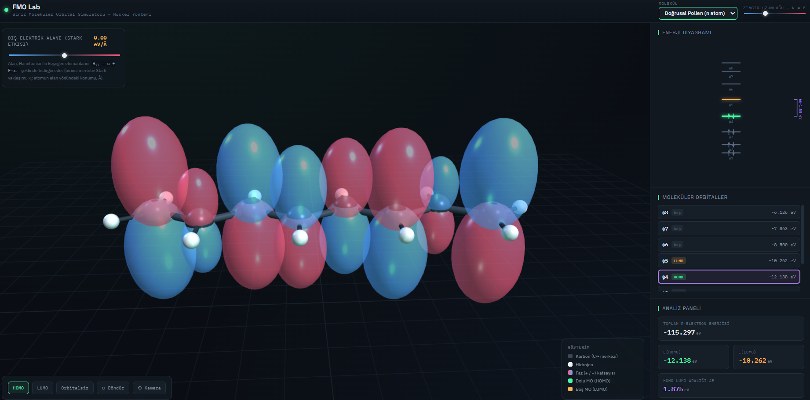
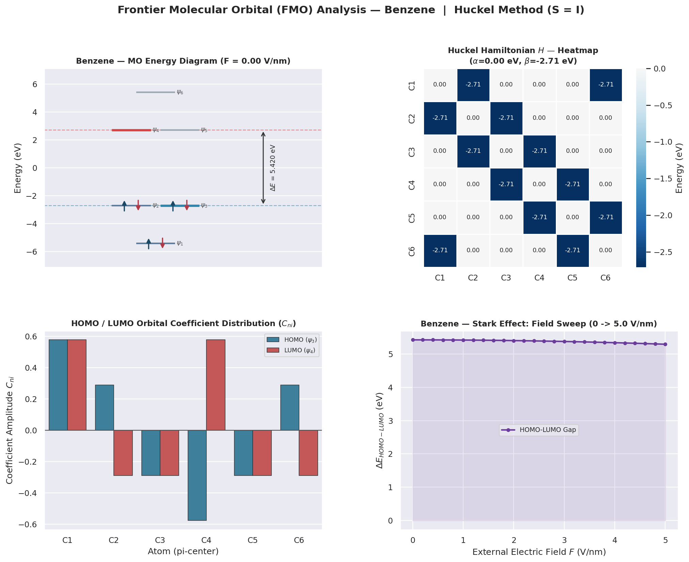

# Frontier Molecular Orbital (FMO) Theory Simulation and Data Analytics

This repository contains a comprehensive computational chemistry project designed to simulate, analyze, and visualize Frontier Molecular Orbitals (FMO) using quantum mechanical principles. The project is split into two distinct frameworks: a high-fidelity mathematical data science backend powered by Python, and an interactive 3D web-based visualization frontend powered by JavaScript and Three.js.

---

## Technical Overview

The entire simulation relies on the Hückel Molecular Orbital (HMO) theory to evaluate conjugated pi-systems such as Ethylene, Butadiene, Hexatriene, and Benzene. The project mathematically solves the secular equation:

(H - ES)C = 0

Where H represents the Hamiltonian matrix, S is the overlap matrix (assumed as an identity matrix I for simplicity), E denotes the eigenvalues (orbital energy levels), and C represents the eigenvectors (wavefunction coefficients).

Additionally, both modules incorporate quantum perturbation theory to simulate the Stark Effect, demonstrating how an external electric field shifts the energy states and manipulates the HOMO-LUMO gap.

---

## Repository Structure

### 1. 3D Web Visualizer (fmo_simulator.html)
A standalone, client-side web application built with pure JavaScript and Three.js.
* Computes eigenvalues and eigenvectors in real-time using an optimized Jacobi diagonalization algorithm written from scratch.
* Dynamically renders 3D p-orbital lobes based on calculated wavefunction coefficients (C_ni), where lobe size corresponds to magnitude and color corresponds to mathematical sign (+/-).
* Features an HTML5 Canvas panel displaying a Pauli-compliant molecular orbital energy diagram with active spin vectors.

### 2. Quantum Data Analyzer (fmo_analiz.py)
A robust data science module designed for exact quantum chemistry computations and automated statistical analysis.
* Utilizes NumPy and SciPy (scipy.linalg.eigh) for full matrix diagonalization and structural calculation of complex conjugated models.
* Pipelines raw eigenvector and eigenvalue datasets into a Pandas DataFrame for structured data manipulation.
* Automatically plots comprehensive matrix graphics and exportable quantum telemetry.

---

## Visual Documentation

### Interactive 3D Simulation Frontend
The image below illustrates the Three.js molecular interface displaying 3D orbital lobes, dynamic user controls for the Stark Effect slider, and the real-time canvas energy grid:



### Quantum Telemetry and Data Visualization Panel
The generated analysis report provides deep mathematical insights through multi-plot matrix graphics:
1. Molecular Orbital Energy Chart: Plots the exact energy distribution with paired spin states.
2. Hamiltonian Interaction Heatmap: Visualizes matrix coupling and bond energy topologies via Seaborn.
3. Wavefunction Distribution Bar Plot: Charts orbital density distribution across carbon nodes.



---

## Installation and Execution

### Prerequisites
Ensure you have Python 3.x installed along with the required scientific libraries.

```bash
pip install numpy scipy matplotlib seaborn pandas
